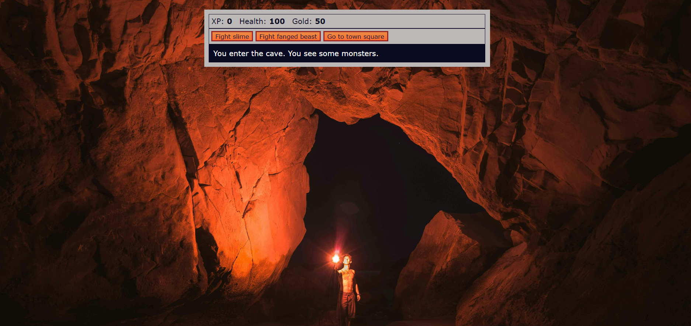

# RPG-Dragon-Repeller

- [Overview](#overview)
  - [Screenshot](#screenshot)
  - [Links](#links)
- [My process](#my-process)
  - [Built with](#built-with)
  - [What I learned](#what-i-learned)
  - [Continued development](#continued-development)
  - [Useful resources](#useful-resources)
- [Author](#author)
- [Acknowledgments](#acknowledgments)

## Overview
- This is Role Playing Game that works with arrays, strings, objects, functions, loops, if/else statements, and more. Rescue the local town from monsters that have moved into a nearby cave. Purchase various weapons from the store. Can you find the hidden treasure trove on your quest?

### Screenshot

### Links
- Solution URL:
 https://github.com/Dev-Wy/
- Live Site URL:
 https://dev-wy.github.io/

## My Process
### Built with
- HTML
- CSS
- JavaScript

### What I learned
- This project refreshed my JavaScript knowledge and helped me connect how each part works it build on each other as the JS fills out. I like the game master's hidden easter egg idea. 

### Continued development
- I enjoyed adding some flare to the basic CSS. I'd like to be able to add in pictures to go along with the changing locations. I would also like to change the number of buttons featured when only one is necessary verses the general three.

### Useful Resources: 
- I love W3C School's validation services. 
- https://validator.w3.org/   
- https://jigsaw.w3.org/css-validator/

## Author
- Jake Wyant
- Portfolio: https://dev-wy.github.io/Portfolio/
- https://forum.freecodecamp.org/u/dev-wy/summary

## Acknowledgments
- Thanks to FreeCodeCamp.org for this project.
- W3C for their resources. 
- Special thanks to Skillcrush for giving me the foundation to build on.
